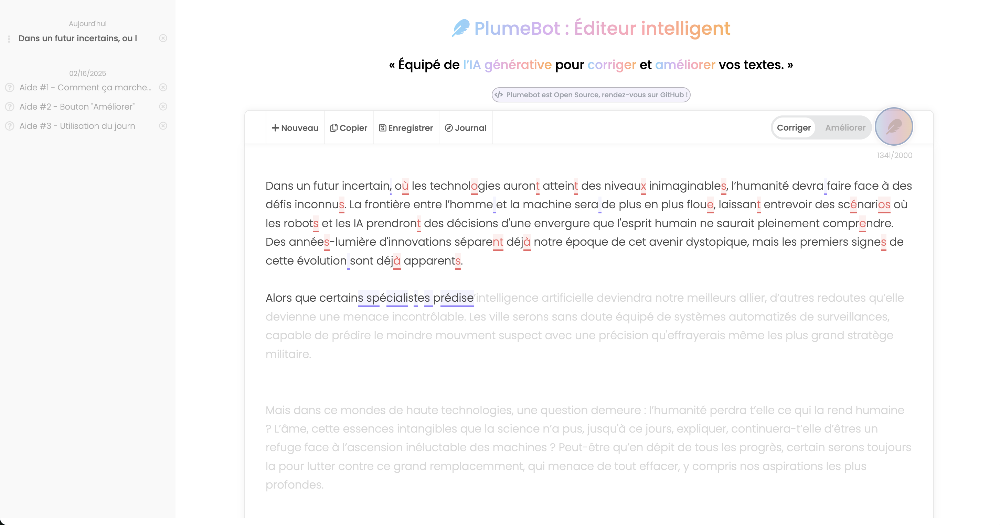

## Titre : Plumebot_v2 - Documentation Open Source

« Un éditeur de texte simple et clair, Open Source propulsé par l’IA générative pour corriger et améliorer vos textes. »

**Version** : 2.0.0  

**Date de publication** : 07 février 2025

**Créateur** : Christophe CONIGLIO

**Contact** : christophe.coniglio@gmail.com

---
## Image de l'application



---

## Licence

Ce travail est sous licence Creative Commons Zero (CC0). Vous pouvez copier, modifier, distribuer et réaliser ce travail, même à des fins commerciales, sans avoir à demander la permission.

This work is licensed under the Creative Commons Zero (CC0) License. You can copy, modify, distribute and perform the work, even for commercial purposes, all without asking permission.

---

## Description
Plumebot_v2 est un correcteur orthographique et grammatical alimenté par l'IA générative (gpt4o ici). Le projet propose une interface moderne permettant de saisir du texte, visualiser les corrections effectuées et conserver un historique des modifications pour un retour interactif sur les anciennes saisies.

Information : L'ouverture de ce projet en open source a pour objectif de favoriser la collaboration en vue d'industrialiser et d'améliorer ce POC. Il est important de noter que le projet n'est pas encore industrialisé et que son maintien reste complexe. Son but principal est de démontrer une preuve de concept simple.

La version "2" propose deux nouvelles fonctionnalités majeures :
- Une interaction améliorée avec un éditeur de texte unique où le texte est écrit et corrigé en même temps.
- Un panneau permettant de sauvegarder et de reprendre tous les textes écrits.

---

## Fonctionnalités
- **Correction orthographique et grammaticale en temps réel** : Visualisation des différences entre le texte original et le texte corrigé.
- **Interface utilisateur moderne** : Éditeur de texte centré et ergonomique.
- **Historique interactif** : Panneau permettant de revenir rapidement sur les anciens textes corrigés.
- **Compatibilité étendue PHP** : Simulation de stream sur des environnements où cette fonctionnalité n'est pas activée.

---

## Architecture Fonctionnelle
1. **Interface utilisateur** : Conçue avec HTML et CSS pour offrir une expérience moderne et intuitive.
2. **Correction et suivi** : Implémentation de `diff_match_patch` pour identifier les différences entre le texte d’entrée et les corrections.
3. **Historique des modifications** : Panneau interactif affichant les premiers mots des anciens textes pour faciliter la navigation.
4. **Gestion de flux en environnement limité** : Hack PHP permettant la simulation de stream.

---

## Architecture Technique
Le projet repose sur une pile technologique simple :
- **Frontend** : HTML, CSS, JavaScript.
- **Backend** : PHP avec une gestion astucieuse des limitations de stream.

### COTS  
Le projet utilise trois composants logiciels prêts à l'emploi :  
- **Accès externe via un CDN** : Font Awesome (version gratuite 5.x) pour afficher facilement des icônes.  
- **Intégré dans les sources** : Bibliothèque `diff_match_patch` de Google pour le traitement des différences de texte ([lien GitHub](https://github.com/google/diff-match-patch)).  
- **Intégré dans les sources** : Police d’écriture fournie par Google.  

### Modules principaux
1. **Interface graphique** :
   - Conception CSS inspirée des interfaces modernes de 2025.
2. **Simulation de stream PHP** :
   - Hack permettant de récupérer les corrections en temps réel même sur des plateformes sans support natif pour les flux.
3. **Module d'édition de texte** :
   - Composant central intégrant `diff_match_patch` pour la gestion des différences.
4. **Panneau historique** :
   - Affichage des anciens textes sous forme interactive.

---

## Améliorations Proposées
### Refactorisation du Code
Le code actuel constitue une preuve de concept. Une ouverture en open source permettra d’industrialiser l’application via :
1. **Modularisation** :
   - Séparation en modules clés :
     - Formulaire d’édition et visualisation des différences.
     - Interactions PHP/JS pour la récupération des corrections.
     - Panneau d’historique interactif.

2. **Optimisation de l’affichage** :
   - Gestion adaptative des éléments affichés pour éviter une surcharge de `localStorage`.
   - Chargement dynamique des entrées d’historique.

3. **Amélioration des performances** :
   - Réduction de la consommation de ressources lors de la manipulation des différences.

---

## Liste des versions

- **2.0.0** : Nouvelles fonctionnalités et Plumebot devient open source.  
- **1.0.0** : Non disponible en open source, une démo est accessible ici : [https://plumebot.com/pbv1/](https://plumebot.com/pbv1/)  


---

## Instructions d’Installation
1. **Prérequis** :
   - Serveur PHP 8.x
   - Navigateur récent compatible avec HTML5/CSS3.

2. **Installation** :  
- Clonez le dépôt :  
- Déployez les fichiers sur votre serveur.  
- Ajoutez votre clé OpenAI dans le fichier PHP disponible à ce chemin : `./SRC/SRC-PHP/requestAPIstreamDisk.php`  

   ```php
   $ch = curl_init();  
   $url = "https://api.openai.com/v1/chat/completions";  
   $headers = array(  
       "Content-Type: application/json",  
       "Authorization: Bearer sk-votre_cle_openai"  
   );  

---

## Contribution
Les contributions sont les bienvenues pour améliorer le projet :
- **Suggestions fonctionnelles**
- **Correction de bugs**
- **Optimisation des performances**

Pour participer :
1. Forkez le projet.
2. Créez une branche pour vos modifications.
3. Soumettez une pull request.

---


